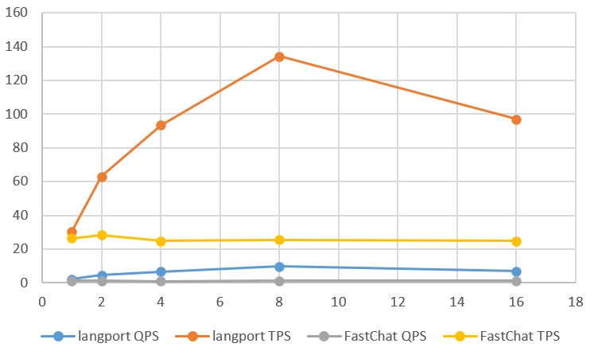

# langport
LangPort is a open-source large language model serving platform.
Our goal is to build a super fast LLM inference service. Currently, langport infer a 7B LLaMA model loaded bf16 with a speed of 6.82 QPS and 168.26 tokens/s on four RTX3090s.

This project is inspired by [lmsys/fastchat](https://github.com/lm-sys/FastChat), we hope that the serving platform is lightweight and fast, but fastchat includes other features such as training and evaluation make it complicated.

The core features include:
- A distributed serving system for state-of-the-art models.
- Streaming batch inference for higher throughput.
- OpenAI-Compatible RESTful APIs.
- FauxPilot-Compatible RESTful APIs.

## Benchmark
We use single RTX3090 to run a finetuned 7B LLaMA model (OpenBuddy V0.9) in the bf16 setting. We use 32 threads to submit chat tasks to the server, and the following figure shows the Queries Per Second (QPS) and Tokens Per Second (TPS) of FastChat and LangPort with different max model concurrency settings.




## News
- [2023/05/10] Langport project started.
- [2023/05/14] Batch inference supported.
- [2023/05/22] New distributed architecture.
- [2023/05/23] Add chat throughput test script.


## Install

### Method 1: With pip

```bash
pip3 install git+https://github.com/vtuber-plan/langport.git 
```

### Method 2: From source

1. Clone this repository
```bash
git clone https://github.com/vtuber-plan/langport.git
cd langport
```

2. Install the Package
```bash
pip install --upgrade pip
pip install -e .
```

## Start the server

It is simple to start a single node chat API service:
``` bash
python -m langport.service.server.generation_worker --port 21001 --model-path <your model path>
python -m langport.service.gateway.openai_api
```

If you need the embeddings API or other features, you can deploy a distributed inference cluster:
``` bash
python -m langport.service.server.dummy_worker --port 21001
python -m langport.service.server.generation_worker --model-path <your model path> --neighbors http://localhost:21001
python -m langport.service.server.embedding_worker --model-path <your model path> --neighbors http://localhost:21001
python -m langport.service.gateway.openai_api --controller-address http://localhost:21001
```

In practice, the gateway can connect to any node to distribute inference tasks:

``` bash
python -m langport.service.server.dummy_worker --port 21001
python -m langport.service.server.generation_worker --port 21002 --model-path <your model path> --neighbors http://localhost:21001
python -m langport.service.server.generation_worker --port 21003 --model-path <your model path> --neighbors http://localhost:21001 http://localhost:21002
python -m langport.service.server.generation_worker --port 21004 --model-path <your model path> --neighbors http://localhost:21001 http://localhost:21003
python -m langport.service.server.generation_worker --port 21005 --model-path <your model path> --neighbors http://localhost:21001 http://localhost:21004
python -m langport.service.gateway.openai_api --controller-address http://localhost:21003 # 21003 is OK!
python -m langport.service.gateway.openai_api --controller-address http://localhost:21002 # Any worker is also OK!
```

## License

langport is released under the MIT License.


## See also

- [langport-docs](https://langport.readthedocs.io/)
- [langport-source](https://github.com/vtuber-plan/langport)
